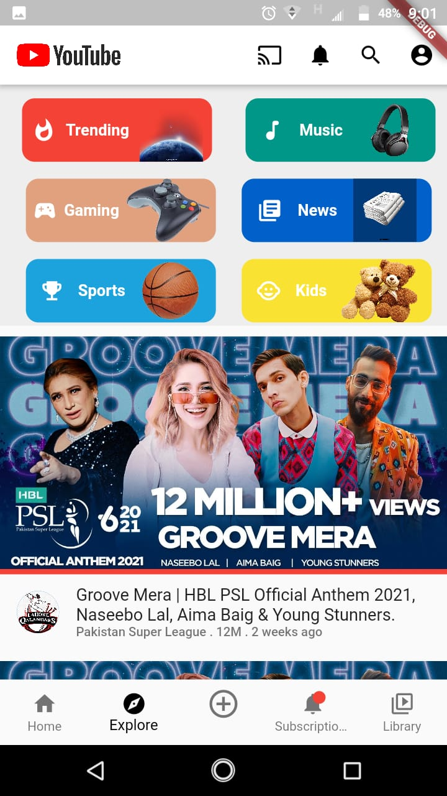

# challenge_screen1

I am new to flutter and I created this project just by waching the image provided by Flutter karachi team.
## Youtube Clone UI

This project is a starting point for a Flutter application.

I have used reusable widgets and t:

- Used Reusable widgets
- List view for scrolling
- Stacked icon to show the notification bade in bottom nave bar.

## Installation process just clone the repo and copy the images and lib folder to your project

## output

